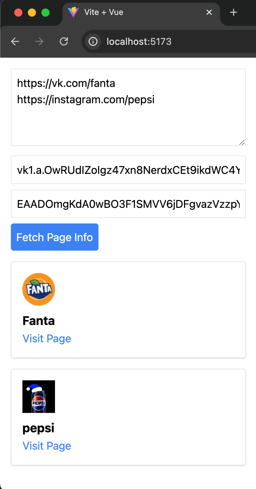
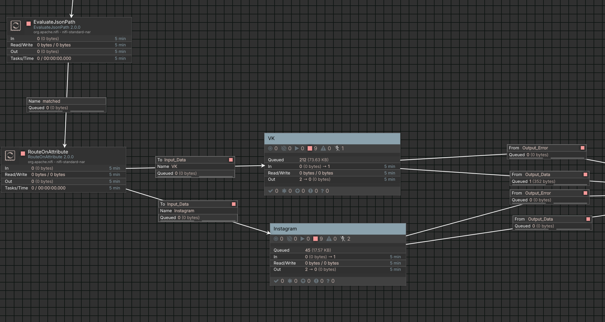
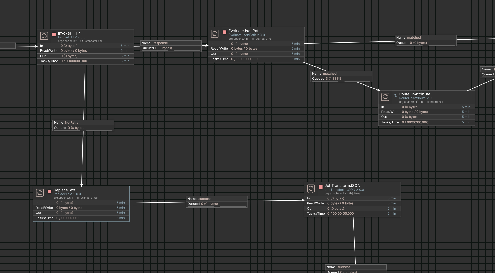

# Social Media Pages VK and Instagram: Vue3 + Apache NiFi

## Project Description

This project integrates a Vue 3 web application with a backend implemented using Apache NiFi to process and collect information about social media pages on VK and Instagram. The main goal of the application is to allow users to retrieve structured information about social media pages or receive error messages in case of failed requests.

### Implementation Features

1. **Frontend (Vue 3):**
   - A modern user interface for working with social media pages.
   - Input fields for VK and Instagram page links, along with token-based authentication.
   - Asynchronous communication with the server to process requests and handle responses.
   - User-friendly display of results:
     - Page name and profile picture.
     - Link to the profile.
     - Error messages in case of request issues.

2. **Backend (Apache NiFi):**
   - Integration with VK and Instagram APIs to handle data requests.
   - Flexible data processing using NiFi processors:
     - **Request handling**: `HandleHttpRequest` and `HandleHttpResponse` manage incoming requests and return responses.
     - **Data routing**: `RouteOnAttribute` and `EvaluateJsonPath` determine target APIs based on input data.
     - **Data transformation**: `JoltTransformJSON` converts JSON responses into the desired format.
   - Modular structure: separate process groups for handling data from VK and Instagram, simplifying management and scalability.

### Project Features

- **Vue 3** integration for a fast and interactive user interface with real-time capabilities.
- **Apache NiFi** usage for scalable, modular, and customizable backend data processing.
- Support for two popular social media platforms—VK and Instagram—with flexible request routing.
- Easy configuration and potential for extending functionality on both the frontend and backend.

---

### Screenshots

- **Web Interface Example:**  
  

- **NiFi Overview Diagram:**  
  

- **NiFi Instagram Process Group:**  
  

---

This project demonstrates modern approaches to integrating UI and backend logic, streamlining the development and maintenance of systems that work with social media APIs.

## How to Use

1. **Clone the repository** and install frontend dependencies:
   ```bash
   npm install

2. **Run the Vue application:** and install frontend dependencies:
   ```bash
   npm run dev

  Or using Docker:
  ```bash
  docker compose up --build
  ```

3. **Set up and start Apache NiFi**:

- Import the provided NiFi configuration file (details will be provided in the next section).
- Ensure NiFi is configured to accept requests on http://localhost:8081/contentListener.

4. **Access the application:**

- Open the Vue application in your browser at http://localhost:5173.
- Enter the links to VK or Instagram pages and the corresponding access tokens.
- Click "Fetch Page Info" to retrieve the information.

5. **View results**:

- Successful requests will display page details such as the name, profile picture, and a link to the profile.
- Errors will show descriptive messages indicating what went wrong.   
